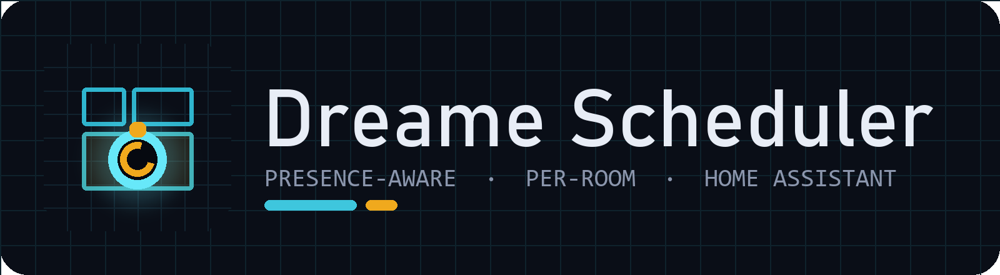
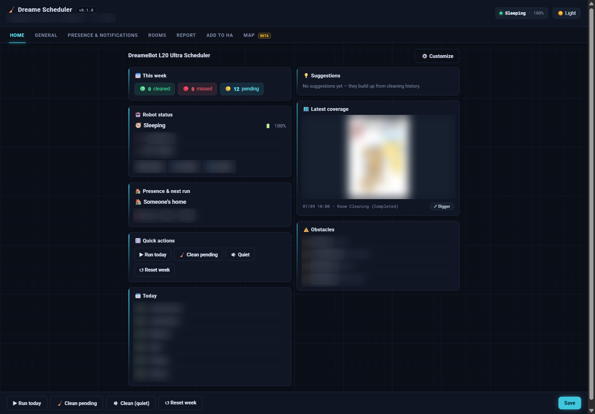
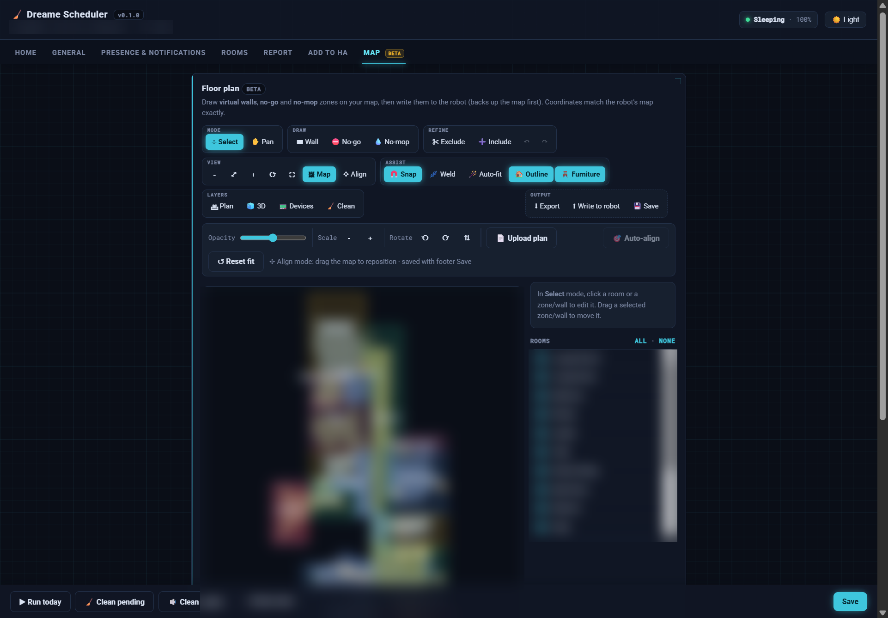

  

  <strong>Home Assistant add-on — the configuration panel &amp; Floor Plan Studio for the Dreame Scheduler integration.</strong>

  
  
  
  

A GUI (behind ingress) for the
[Dreame Scheduler integration](https://github.com/botts7/dreame-scheduler) —
install the integration first, then add this repository. Set everything up
without editing YAML, see a weekly report, copy ready-made dashboard cards, and
design a floor plan.

## Highlights

| 🏠 Cleans when you're out | 📊 Tells you what happened | 🛟 Frees a stuck robot |
|---|---|---|
| Gates on your presence entities with a grace delay, and steps aside to the dock the moment someone comes home — resuming once the house is empty again. | A weekly report of what got cleaned, what was missed and _why_ — with the robot's own coverage renders, flagged obstacles, and a run-history trend. | If it wedges mid-clean, the scheduler walls off the spot, backs it out, and carries on — instead of leaving it stranded and the run half-done. |

## Screenshots

_(Floor-plan details blurred for privacy.)_

_Overview — robot status, next run, this week's progress, suggestions and coverage._

_Floor Plan Studio (beta) — draw no-go / no-mop zones and virtual walls, auto-fit &amp; weld rooms, a live 3D view, and export to your own dashboard._

_Report — per-room status this week, why rooms were missed, and the robot's own coverage renders._

## Install

1. Install the **Dreame Scheduler** integration (HACS) and add your vacuum.
2. In Home Assistant: **Settings → Add-ons → Add-on Store → ⋮ → Repositories**,
   add `https://github.com/botts7/dreame-scheduler-addon`.
3. Install **Dreame Scheduler**, start it, and open it from the sidebar.

Prebuilt for amd64 / aarch64 / armv7; the deps are pure-Python so it installs
fast on a Raspberry Pi too. See the add-on's **Documentation** tab for details.

## Security

The add-on talks to Home Assistant with the Supervisor token, which stays in the
backend and is never sent to the browser. It requests only `homeassistant_api`
(no `hassio_api`), and its internal port only accepts requests from the ingress
gateway, so other add-ons can't reach it.

## License

MIT © botts7 · Issues: <https://github.com/botts7/dreame-scheduler/issues>
